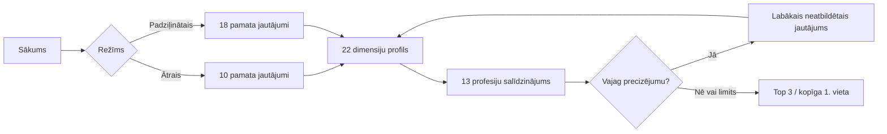

# VTDT karjeras un profesiju izvēles palīgs

## Direktora informatīvais apraksts

**Modeļa versija:** 2026.5  
**Sagatavots:** 2026. gada 4. septembrī  
**Oficiālais profesiju avots:** [VTDT profesiju katalogs](https://www.vtdt.lv/profesijas)

> Šis dokuments izskaidro rīka darbību vadības, pedagogu un karjeras atbalsta vajadzībām. Rīks palīdz sākt profesiju izpēti, bet nav zinātniski validēts psiholoģisks tests.

## 1. Mērķis un auditorija

VTDT karjeras palīgs ir paredzēts galvenokārt 9.–10. klašu jauniešiem aptuveni 14–17 gadu vecumā. Tā uzdevums nav “izlemt skolēna vietā”, bet īsā sarunveida testā pamanīt interešu, domāšanas veida un vēlamās darba vides kombināciju un piedāvāt trīs VTDT profesijas tālākai izpētei.

Rīks ir statiska tīmekļa aplikācija bez ārēja servera, datubāzes un izsekošanas. Tā darbojas GitHub Pages un rezultātu aprēķina lietotāja pārlūkā.

## 2. Ātrais un padziļinātais režīms

| Kritērijs | Ātrais tests | Padziļinātais tests |
|---|---|---|
| Mērķis | Ātra iepazīšanās un Top 3 | Plašāks profesiju salīdzinājums |
| Pamata jautājumi | 10 | 18 |
| Adaptīvi precizējumi | 0–3 | 0–2 |
| Kopējais jautājumu skaits | 10–13 | 18–20 |
| Aptuvenais laiks | 1–2 minūtes | ap 3 minūtēm |
| Dimensiju grupu pārklājums | visas 3 grupas un visas 22 dimensijas | visas 3 grupas un visas 22 dimensijas ar atkārtotiem mērījumiem |

Ātrais tests ir sākuma ekrāna ieteiktais režīms. Ja jaunietis vēlas plašāku salīdzinājumu, viņš var turpināt padziļinātajā režīmā, saglabājot pirmo desmit jautājumu atbildes.



## 3. Aktuālās profesijas pa nozarēm

Runtime katalogā ir tieši 13 profesijas, kas 2026. gada 1. augustā bija norādītas VTDT aktuālajā katalogā.

| Nozare | Profesijas |
|---|---|
| Autotransports | Automehāniķis; Autovirsbūvju remonta tehniķis |
| Būvniecība | Apdares darbu tehniķis; Ēku būvtehniķis; Namdaris; Arhitektūras tehniķis |
| Dizains | Apģērbu dizainera asistents |
| Enerģētika | Elektrotehniķis |
| Informācijas un komunikācijas tehnoloģijas | Datorsistēmu tehniķis; Programmēšanas tehniķis |
| Kokapstrāde | Mēbeļu galdnieks |
| Lauksaimniecība | Lauksaimniecības mehanizācijas tehniķis; Augkopības tehniķis |

Inženiersistēmu būvtehniķis un Atjaunojamās enerģētikas tehniķis jaunajā runtime versijā nav iekļauti, jo tie nav aktuālajā VTDT katalogā. To vēsturiskais stāvoklis saglabāts projekta arhīva versijā.

## 4. Kāpēc jautājumi ir netieši

Tieši jautājumi, piemēram, “Vai Tev patīk programmēt?” vai “Vai Tev patīk remontēt automašīnas?”, ļauj jaunietim atminēt rezultātu un bieži mēra jau zināmu profesijas nosaukuma simpātiju, nevis darba stilu. Tāpēc jaunais komplekts izmanto starpnozaru situācijas: kļūdas atrašanu, taustāma rezultāta nozīmi, telpisku iztēli, pacietību, mainīgus apstākļus, darba secību, sadarbību un citus signālus.

Katrs pamata jautājums vienlaikus ietekmē 3–6 dimensijas. Atbilde neatsaucas uz profesijas ID. Viena atbilde tiek apzināti slāpēta ar pierādījuma uzticamību, tāpēc tā nevar izveidot praktiski izšķirtu rezultātu.

## 5. Visi 18 pamata jautājumi un to dimensiju svari

Svars tabulā ir jautājuma dimensiju vektors pirms atbildes koeficienta. Piemēram, “Drīzāk jā” reizina visas rindā norādītās vērtības ar `+1`, bet “Nē” — ar `−2`.

| Nr. | Režīms | Jautājums | Mērītās dimensijas un vektora svars |
|---:|---|---|---|
| 1 | Ātrais + padziļinātais | Ja kaut kas nedarbojas, vai Tu gribi noskaidrot, kas tieši vainīgs? | Izpēte un analīze (1); Mehānika un diagnostika (0,75); Datori un tīkli (0,65); Elektrība un enerģija (0,55); Programmēšana (0,45); Precizitāte un pacietība (0,4) |
| 2 | Ātrais + padziļinātais | Vai Tev patīk lietām piešķirt savu stilu un izskatu? | Radošums un forma (1); Tekstils un dizains (0,8); Telpa un rasēšana (0,5); Kokapstrāde (0,35); Metāls un virsbūves (0,35); Precizitāte un pacietība (0,3) |
| 3 | Ātrais + padziļinātais | Ja uzdevums apnīk, vai Tu tāpat cīnies līdz galam? | Patstāvīga koncentrēšanās (1); Precizitāte un pacietība (0,9); Kārtība un process (0,45); Programmēšana (0,35); Kokapstrāde (0,35); Metāls un virsbūves (0,35) |
| 4 | Ātrais + padziļinātais | Vai Tu spēj iejusties cita cilvēka lomā un sajūtās? | Sadarbība un atbalsts (1); Komandas darbs (0,8); Radošums un forma (0,4); Iniciatīva un koordinēšana (0,35); Tekstils un dizains (0,25); Būvniecības process (0,25) |
| 5 | Ātrais + padziļinātais | Vai Tu labprāt daļu dienas pavadītu, strādājot ārā? | Darbs ārā (1); Fiziska darbošanās (0,65); Praktiska darbošanās (0,5); Augi un daba (0,45); Lauksaimniecības tehnika (0,4); Būvniecības process (0,3) |
| 6 | Ātrais + padziļinātais | Vai Tu viegli pielāgojies, ja plāns pēkšņi mainās? | Iniciatīva un koordinēšana (0,8); Komandas darbs (0,55); Darbs ārā (0,35); Augi un daba (0,35); Izpēte un analīze (0,3); Praktiska darbošanās (0,2) |
| 7 | Ātrais + padziļinātais | Vai Tev patīk darīt visu noteiktā secībā no sākuma? | Kārtība un process (1); Precizitāte un pacietība (0,6); Programmēšana (0,45); Elektrība un enerģija (0,45); Būvniecības process (0,4); Lauksaimniecības tehnika (0,3) |
| 8 | Ātrais + padziļinātais | Vai Tev patīk izjaukt lietas un saprast, kā tās darbojas? | Mehānika un diagnostika (1); Datori un tīkli (0,75); Izpēte un analīze (0,7); Elektrība un enerģija (0,6); Lauksaimniecības tehnika (0,5); Praktiska darbošanās (0,4) |
| 9 | Ātrais + padziļinātais | Vai Tev patīk vispirms uzzīmēt vai izplānot savu ideju? | Telpa un rasēšana (1); Radošums un forma (0,75); Kārtība un process (0,45); Būvniecības process (0,4); Programmēšana (0,35); Tekstils un dizains (0,35) |
| 10 | Ātrais + padziļinātais | Vai Tu labprāt pavadītu vairākas stundas pie datora? | Programmēšana (0,85); Patstāvīga koncentrēšanās (0,65); Datori un tīkli (0,5); Izpēte un analīze (0,35); Fiziska darbošanās (-0,45); Darbs ārā (-0,45) |
| 11 | Padziļinātais | Vai Tev patīk saprast, kā darbojas dažādi mehānismi? | Izpēte un analīze (0,55); Praktiska darbošanās (0,5); Mehānika un diagnostika (1); Lauksaimniecības tehnika (0,5); Fiziska darbošanās (0,35); Telpa un rasēšana (0,25) |
| 12 | Padziļinātais | Vai Tu vari patstāvīgi pabeigt uzdevumu bez biežas palīdzības? | Patstāvīga koncentrēšanās (1); Precizitāte un pacietība (0,45); Kārtība un process (0,45); Izpēte un analīze (0,35); Programmēšana (0,55); Telpa un rasēšana (0,4) |
| 13 | Padziļinātais | Vai Tu ātri pamani, ja kaut kas ir šķībs vai nelīdzens? | Radošums un forma (0,7); Precizitāte un pacietība (0,8); Metāls un virsbūves (0,9); Praktiska darbošanās (0,3); Telpa un rasēšana (0,25) |
| 14 | Padziļinātais | Vai pirms lēmuma Tu pārbaudi faktus, nevis tikai mini? | Izpēte un analīze (0,85); Kārtība un process (0,6); Programmēšana (0,45); Elektrība un enerģija (0,55); Augi un daba (0,5); Precizitāte un pacietība (0,4) |
| 15 | Padziļinātais | Vai Tev patiktu rūpēties par augiem un redzēt, kā tie aug? | Augi un daba (1); Darbs ārā (0,6); Izpēte un analīze (0,6); Praktiska darbošanās (0,3); Būvniecības process (0,3); Radošums un forma (0,2) |
| 16 | Padziļinātais | Vai Tev patīk pārveidot materiālus pēc savas ieceres? | Praktiska darbošanās (0,8); Radošums un forma (0,7); Kokapstrāde (0,65); Metāls un virsbūves (0,6); Tekstils un dizains (0,7); Precizitāte un pacietība (0,45) |
| 17 | Padziļinātais | Vai pirms lietošanas Tu pārbaudi, vai viss darbojas droši? | Elektrība un enerģija (0,8); Datori un tīkli (0,6); Mehānika un diagnostika (0,55); Izpēte un analīze (0,55); Kārtība un process (0,45); Precizitāte un pacietība (0,5) |
| 18 | Padziļinātais | Vai pirms darba sākšanas Tu izdomā, ko darīsi vispirms? | Iniciatīva un koordinēšana (0,65); Kārtība un process (0,75); Programmēšana (0,55); Būvniecības process (0,7); Komandas darbs (0,4); Sadarbība un atbalsts (0,35) |

## 6. Četru atbilžu koeficienti

| Atbilde | Koeficients |
|---|---:|
| Jā | +2 |
| Drīzāk jā | +1 |
| Drīzāk nē | -1 |
| Nē | -2 |

Skalā nav neitrālas izvēles. Jaunietis izvēlas tuvāko no divām pozitīvām vai divām negatīvām atbildēm; neviena atbilde profesiju nepiešķir tieši.

## 7. Gala formula

Profils izmanto divus satura slāņus un trīs gala grupas:

| Grupa | Dimensiju skaits | Gala svars |
|---|---:|---:|
| RIASEC intereses | 6 | 25% |
| Konkrēti uzdevumi un profesionālās intereses | 11 | 55% |
| Darba vide un darba stils | 5 | 20% |

```text
atbilstības rādītājs = 100 × (
  0,25 × RIASEC sakritība +
  0,55 × uzdevumu/interešu sakritība +
  0,20 × vides/stila sakritība
)
```

Katras dimensijas signālu normalizē pret faktiski saturiski atbildētajiem jautājumiem. Uzticamība pieaug, ja par dimensiju ir vairāki savstarpēji saskanīgi signāli; pretrunīgas atbildes uzticamību samazina.

**Vienkāršots piemērs.** Ja RIASEC sakritība ir `0,70`, uzdevumu sakritība `0,80`, bet vides/stila sakritība `0,60`, tad:

```text
100 × (0,25 × 0,70 + 0,55 × 0,80 + 0,20 × 0,60) = 73,5
```

Rezultātā redzams **73,5 / 100** atbilstības rādītājs. Tas nav 73,5% varbūtība.

## 8. Adaptīvo precizējumu princips

Precizējumu var aktivizēt trīs iemesli: ļoti maza Top 1–Top 2 starpība, praktiski vienāds Top 3 vai nepietiekams dimensiju grupas pārklājums.

Algoritms no 16 netiešu jautājumu bankas izvēlas neatbildēto kandidātu, kas:

1. vislabāk nošķir pašreizējo Top 2 un Top 3 profesiju dimensiju profilus;
2. papildina vēl vāji mērītas dimensijas;
3. pēc vektora nav pārāk līdzīgs jau uzdotajiem jautājumiem.

Kandidātu neuzdod, ja tā dimensijas jau ir pietiekami nosegtas. Izvēle ir determinēta: vienāda atbilžu vēsture vienmēr dod to pašu precizējumu. Gan pamata, gan uzdotie precizējošie jautājumi piedalās informācijas pietiekamības aprēķinā. Ja pēc režīma limita rezultāti joprojām ir praktiski vienādi, UI rāda kopīgu pirmo vietu, nevis mākslīgu uzvarētāju.

| Nr. | Precizējošais jautājums | Spēcīgākais “jā” virziens | Spēcīgākais pretējais virziens |
|---:|---|---|---|
| 1 | Vai Tev vairāk patīk atrast kļūdu nekā mainīt izskatu? | Izpēte un analīze, Programmēšana, Datori un tīkli | Radošums un forma, Tekstils un dizains, Metāls un virsbūves |
| 2 | Vai Tev labāk patīk skaidrs plāns nekā neparedzama diena? | Kārtība un process, Telpa un rasēšana, Patstāvīga koncentrēšanās | Fiziska darbošanās, Darbs ārā, Praktiska darbošanās |
| 3 | Vai Tu labprāt organizē citus, nevis strādā viens? | Komandas darbs, Sadarbība un atbalsts, Iniciatīva un koordinēšana | Patstāvīga koncentrēšanās, Precizitāte un pacietība |
| 4 | Vai Tu labāk izmēģini savu ideju nekā seko paraugam? | Radošums un forma, Izpēte un analīze, Programmēšana | Kārtība un process, Precizitāte un pacietība |
| 5 | Vai Tev digitāls rezultāts patīk vairāk nekā paša izgatavots priekšmets? | Programmēšana, Izpēte un analīze, Datori un tīkli | Praktiska darbošanās, Kokapstrāde, Metāls un virsbūves |
| 6 | Vai Tu labprāt strādātu ārā arī mainīgos laikapstākļos? | Augi un daba, Darbs ārā, Izpēte un analīze | Telpa un rasēšana, Kārtība un process, Patstāvīga koncentrēšanās |
| 7 | Vai Tevi vairāk interesē lielas mašīnas nekā sīkas detaļas? | Mehānika un diagnostika, Lauksaimniecības tehnika, Praktiska darbošanās | Precizitāte un pacietība, Tekstils un dizains, Kokapstrāde |
| 8 | Vai gatavā darba izskats Tev ir svarīgāks par tā darbību? | Radošums un forma, Tekstils un dizains, Metāls un virsbūves | Izpēte un analīze, Programmēšana, Datori un tīkli |
| 9 | Vai pirms izvēles Tu vairāk uzticies mērījumiem nekā sajūtām? | Kārtība un process, Elektrība un enerģija, Precizitāte un pacietība | Radošums un forma, Tekstils un dizains, Iniciatīva un koordinēšana |
| 10 | Vai Tu labprātāk strādātu ārā nekā klusā telpā? | Darbs ārā, Fiziska darbošanās, Praktiska darbošanās | Patstāvīga koncentrēšanās, Programmēšana, Telpa un rasēšana |
| 11 | Vai Tev labāk patīk salikt detaļas nekā zīmēt idejas? | Praktiska darbošanās, Mehānika un diagnostika, Datori un tīkli | Radošums un forma, Telpa un rasēšana, Tekstils un dizains |
| 12 | Vai Tev svarīgāk darbu izdarīt rūpīgi nekā ātri? | Precizitāte un pacietība, Patstāvīga koncentrēšanās, Kārtība un process | Komandas darbs, Iniciatīva un koordinēšana, Sadarbība un atbalsts |
| 13 | Vai vari pacietīgi strādāt, ja rezultātu redzēsi tikai vēlāk? | Augi un daba, Būvniecības process, Programmēšana | Praktiska darbošanās, Metāls un virsbūves, Radošums un forma |
| 14 | Vai Tev patīk vairākkārt pārbaudīt, vai viss darbojas pareizi? | Izpēte un analīze, Datori un tīkli, Elektrība un enerģija | Radošums un forma, Tekstils un dizains, Telpa un rasēšana |
| 15 | Vai Tevi vairāk interesē, kā lieta savienota, nevis izskatās? | Mehānika un diagnostika, Datori un tīkli, Elektrība un enerģija | Radošums un forma, Tekstils un dizains, Metāls un virsbūves |
| 16 | Vai Tu viegli maini savu plānu, ja tas vajadzīgs? | Iniciatīva un koordinēšana, Izpēte un analīze, Darbs ārā | Kārtība un process, Precizitāte un pacietība, Patstāvīga koncentrēšanās |

## 9. Validācija, skolēnu profili un simulācijas

Automātiskais komplekts izmanto tikai Node iebūvēto `node:test` un pārbauda datu integritāti, normalizāciju, simetriju, tukšu profilu, atbildes maiņu, neizšķirtus, adaptīvo izvēli, stāvokļa limitus un sasniedzamību.

| Pārbaude | Rezultāts |
|---|---|
| Loģiskās personas | 13 no 13 padziļinātajā režīmā Top 1; 13 no 13 ātrajā režīmā Top 3 |
| Dažādi jauniešu scenāriji | 10 profili; vizuāli radošam profilam apģērbu dizains abos režīmos ir Top 3 |
| Vienas atbildes tests | nevienā gadījumā nav gala līdera; Top 1–Top 2 starpība nepārsniedz 2,5 punktus |
| Ātrais — 30 000 profili | Top 1 diapazons 1,30–17,35%; zemākais Top 3 11,19%; jautājumi 10–13 |
| Padziļinātais — 30 000 profili | Top 1 diapazons 1,74–16,68%; zemākais Top 3 9,46%; jautājumi 18–20 |
| Tukšs profils | visām profesijām 50,0; nav līdera vai fallback profesijas |

Nejauša simulācija pārbauda strukturālu sasniedzamību un pārmērīgu dominanci. Tā neprognozē īstu skolēnu atbilžu sadalījumu.

## 10. Profesiju un dimensiju svaru matrica

Vērtības `0–1` ir redakcionāls profesijas profils. Tās nav VTDT publicēti psihometriski normatīvi. Labākai salasāmībai 22 dimensijas sadalītas četrās tabulās.

### 10.1. RIASEC dimensijas

| Profesija | Praktiska darbošanās | Izpēte un analīze | Radošums un forma | Sadarbība un atbalsts | Iniciatīva un koordinēšana | Kārtība un process |
|---|---:|---:|---:|---:|---:|---:|
| Apģērbu dizainera asistents | 0,55 | 0,35 | 1,00 | 0,45 | 0,40 | 0,65 |
| Lauksaimniecības mehanizācijas tehniķis | 1,00 | 0,75 | 0,15 | 0,35 | 0,50 | 0,70 |
| Augkopības tehniķis | 0,80 | 0,90 | 0,25 | 0,40 | 0,55 | 0,70 |
| Mēbeļu galdnieks | 1,00 | 0,55 | 0,75 | 0,25 | 0,35 | 0,85 |
| Apdares darbu tehniķis | 1,00 | 0,20 | 1,00 | 0,30 | 0,25 | 0,75 |
| Ēku būvtehniķis | 0,85 | 0,65 | 0,30 | 0,65 | 0,90 | 0,90 |
| Namdaris | 1,00 | 0,50 | 0,50 | 0,35 | 0,45 | 0,70 |
| Arhitektūras tehniķis | 0,50 | 0,85 | 0,90 | 0,50 | 0,55 | 0,90 |
| Datorsistēmu tehniķis | 0,75 | 0,95 | 0,20 | 0,50 | 0,40 | 0,85 |
| Programmēšanas tehniķis | 0,20 | 1,00 | 0,55 | 0,30 | 0,40 | 0,80 |
| Automehāniķis | 1,00 | 0,90 | 0,15 | 0,30 | 0,40 | 0,80 |
| Autovirsbūvju remonta tehniķis | 1,00 | 0,55 | 0,60 | 0,25 | 0,35 | 0,75 |
| Elektrotehniķis | 0,90 | 0,90 | 0,15 | 0,40 | 0,50 | 0,95 |

### 10.2. Uzdevumu/interešu dimensijas — 1. daļa

| Profesija | Programmēšana | Datori un tīkli | Mehānika un diagnostika | Metāls un virsbūves | Elektrība un enerģija | Telpa un rasēšana |
|---|---:|---:|---:|---:|---:|---:|
| Apģērbu dizainera asistents | 0,10 | 0,10 | 0,10 | 0,10 | 0,10 | 0,55 |
| Lauksaimniecības mehanizācijas tehniķis | 0,10 | 0,10 | 0,90 | 0,10 | 0,45 | 0,10 |
| Augkopības tehniķis | 0,10 | 0,10 | 0,25 | 0,10 | 0,10 | 0,10 |
| Mēbeļu galdnieks | 0,10 | 0,10 | 0,10 | 0,10 | 0,10 | 0,75 |
| Apdares darbu tehniķis | 0,10 | 0,10 | 0,10 | 0,10 | 0,10 | 0,30 |
| Ēku būvtehniķis | 0,10 | 0,10 | 0,10 | 0,10 | 0,25 | 0,70 |
| Namdaris | 0,10 | 0,10 | 0,10 | 0,10 | 0,10 | 0,70 |
| Arhitektūras tehniķis | 0,20 | 0,10 | 0,10 | 0,10 | 0,10 | 1,00 |
| Datorsistēmu tehniķis | 0,40 | 1,00 | 0,35 | 0,10 | 0,50 | 0,10 |
| Programmēšanas tehniķis | 1,00 | 0,30 | 0,10 | 0,10 | 0,10 | 0,20 |
| Automehāniķis | 0,10 | 0,20 | 1,00 | 0,55 | 0,50 | 0,10 |
| Autovirsbūvju remonta tehniķis | 0,10 | 0,10 | 0,65 | 1,00 | 0,10 | 0,55 |
| Elektrotehniķis | 0,10 | 0,35 | 0,30 | 0,10 | 1,00 | 0,50 |

### 10.3. Uzdevumu/interešu dimensijas — 2. daļa

| Profesija | Būvniecības process | Kokapstrāde | Tekstils un dizains | Augi un daba | Lauksaimniecības tehnika |
|---|---:|---:|---:|---:|---:|
| Apģērbu dizainera asistents | 0,10 | 0,10 | 1,00 | 0,10 | 0,10 |
| Lauksaimniecības mehanizācijas tehniķis | 0,10 | 0,10 | 0,10 | 0,50 | 1,00 |
| Augkopības tehniķis | 0,10 | 0,10 | 0,10 | 1,00 | 0,50 |
| Mēbeļu galdnieks | 0,10 | 1,00 | 0,10 | 0,10 | 0,10 |
| Apdares darbu tehniķis | 0,90 | 0,10 | 0,10 | 0,10 | 0,10 |
| Ēku būvtehniķis | 1,00 | 0,25 | 0,10 | 0,10 | 0,10 |
| Namdaris | 0,85 | 1,00 | 0,10 | 0,10 | 0,10 |
| Arhitektūras tehniķis | 0,75 | 0,10 | 0,10 | 0,10 | 0,10 |
| Datorsistēmu tehniķis | 0,10 | 0,10 | 0,10 | 0,10 | 0,10 |
| Programmēšanas tehniķis | 0,10 | 0,10 | 0,10 | 0,10 | 0,10 |
| Automehāniķis | 0,10 | 0,10 | 0,10 | 0,10 | 0,10 |
| Autovirsbūvju remonta tehniķis | 0,10 | 0,10 | 0,10 | 0,10 | 0,10 |
| Elektrotehniķis | 0,40 | 0,10 | 0,10 | 0,10 | 0,10 |

### 10.4. Darba vide un darba stils

| Profesija | Precizitāte un pacietība | Fiziska darbošanās | Darbs ārā | Komandas darbs | Patstāvīga koncentrēšanās |
|---|---:|---:|---:|---:|---:|
| Apģērbu dizainera asistents | 0,90 | 0,35 | 0,05 | 0,65 | 0,80 |
| Lauksaimniecības mehanizācijas tehniķis | 0,75 | 0,85 | 0,90 | 0,65 | 0,60 |
| Augkopības tehniķis | 0,75 | 0,70 | 1,00 | 0,60 | 0,70 |
| Mēbeļu galdnieks | 1,00 | 0,70 | 0,05 | 0,50 | 0,95 |
| Apdares darbu tehniķis | 0,90 | 0,90 | 0,20 | 0,55 | 0,75 |
| Ēku būvtehniķis | 0,85 | 0,70 | 0,65 | 1,00 | 0,45 |
| Namdaris | 0,80 | 1,00 | 0,90 | 0,80 | 0,60 |
| Arhitektūras tehniķis | 0,95 | 0,15 | 0,10 | 0,75 | 0,85 |
| Datorsistēmu tehniķis | 0,90 | 0,15 | 0,05 | 0,65 | 0,90 |
| Programmēšanas tehniķis | 0,90 | 0,05 | 0,05 | 0,60 | 1,00 |
| Automehāniķis | 0,85 | 0,85 | 0,20 | 0,70 | 0,70 |
| Autovirsbūvju remonta tehniķis | 0,90 | 0,90 | 0,15 | 0,65 | 0,75 |
| Elektrotehniķis | 1,00 | 0,65 | 0,40 | 0,75 | 0,75 |

## 11. Ierobežojumi

- Tas ir karjeras orientācijas palīgs, nevis zinātniski validēts psiholoģisks tests.
- Profesiju dimensiju svari ir redakcionāli, auditējami pieņēmumi; VTDT katalogs apstiprina nosaukumus un nozares, nevis svarus.
- 30 000 nejaušu profilu simulācija neatdarina reālu jauniešu atbildes.
- Intereses var mainīties, un nevienas profesijas ikdienu nevar pilnībā aptvert ar 10 vai 18 jautājumiem.
- Rezultāts nav uzņemšanas lēmums, garantija vai atzinums par skolēna spējām.

## 12. Ieteikumi tālākai pārbaudei

1. Veikt pilotu ar vismaz 30–50 dažādu skolu 9.–10. klašu skolēniem.
2. Pēc testa īsā intervijā pajautāt, vai jautājumi bija saprotami un vai atbildes virziens nebija pārāk acīmredzams.
3. Salīdzināt ātrā un padziļinātā testa Top 3 stabilitāti vieniem un tiem pašiem skolēniem.
4. Iesaistīt VTDT profesionālo programmu pedagogus profilu matricas ekspertu pārskatā.
5. Pārbaudīt rezultātus kopā ar karjeras konsultantu, bet nesaukt to par psihometrisku validāciju bez atbilstošas metodikas.
6. Pēc pilotēšanas dokumentēti koriģēt tikai tos jautājumus vai svarus, kuriem ir atkārtojami pierādījumi.

## 13. Pārvaldība un atjaunināšana

- Aktuālo profesiju katalogu pārbaudīt pirms katra uzņemšanas cikla.
- Jautājumus, dimensijas un profesiju profilus glabāt centralizētajos `data/` failos.
- Pēc datu maiņas obligāti palaist `npm run check` un atjaunot Draw.io ar `npm run generate:diagram`.
- Modeļa izmaiņai palielināt `assessmentVersion`, lai vecs `localStorage` stāvoklis netiktu sajaukts ar jauno jautājumu modeli.

Detalizēta tehniskā formula: [assessment-model.md](assessment-model.md). Rediģējama diagramma: [VTDT-profesiju-izveles-modelis.drawio](VTDT-profesiju-izveles-modelis.drawio).
